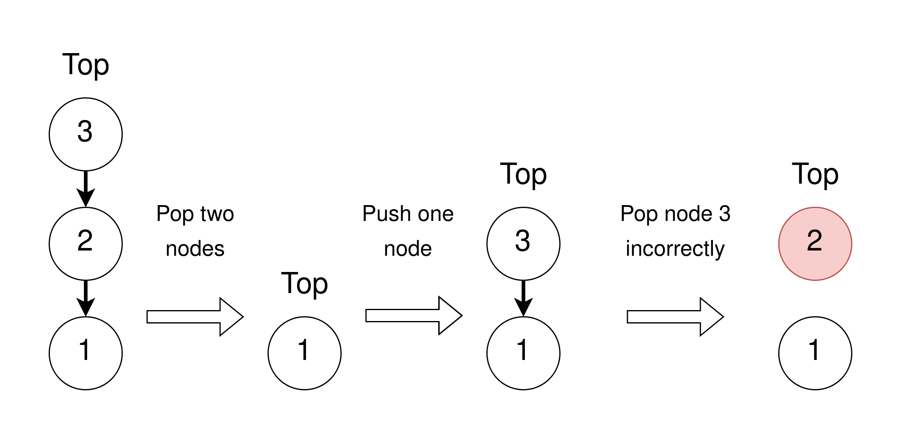
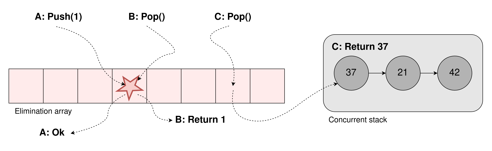
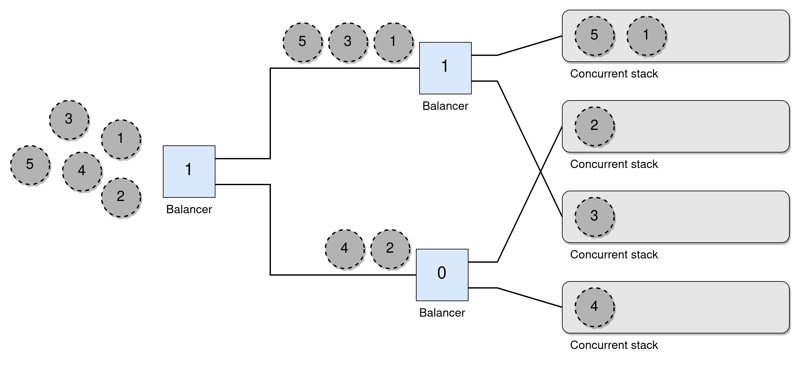
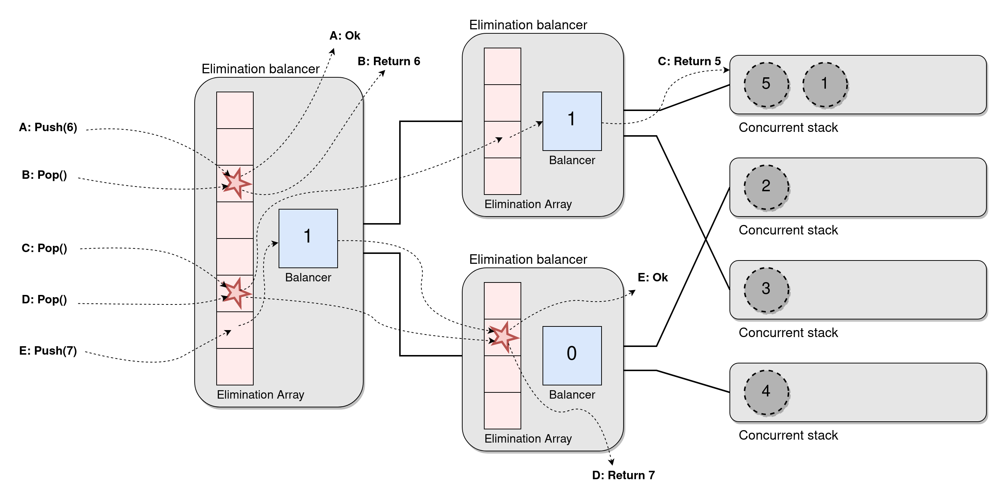

+++
title="Data Structures in the Multicore Age"
description="In the age of increasing hardware parallelism Nir Shavit writes how he thinks software design will be impacted. He argues for the need of looser concurrent structures to reduce the inherent communication costs in strict ones."
date=2022-03-08

[taxonomies]
categories = ["Research summary"]
tags = ["review article", "semantic relaxation", "elimination", "lock-free"]

[extra]
toc = true
+++

In his review article [Data structures in the Multicore Age](https://dl.acm.org/doi/abs/10.1145/1897852.1897873) from 2011 [Nir Shavit](https://www.csail.mit.edu/person/nir-shavit), a prominent researcher in concurrent programming, discussed how the then incoming age of multicores would change how we would need to think about concurrent structures. For me who recently got any idea about hardware it is fascinating to see so concretely that multicores were not at all as common just ten years ago. Before the article parallelism was mainly used in scientific computation and graphics, but systems were largely sequential and boring. With the advent of multicores he postulated this would all change, bringing parallelism to the people. It was not revolutionary at the time, but turned out true.

While surveying the [current state of concurrent data structures](http://people.csail.mit.edu/shanir/publications/concurrent-data-structures.pdf), Shavit also made bolder claims about how the field would need to adapt. He lists the three key insights as follows
> * We are experiencing a fundamental shift in the properties required of concurrent data structures and of the algorithms at the core of their implementation. 
> * The data structures of our childhood —stacks, queues, and heaps— will soon disappear, replaced by looser “unordered” concurrent constructs based on distribution and randomization. 
> * Future software engineers will need to learn how to program using these novel structures, understanding their performance benefits and their fairness limitations.

# Difficulty of Concurrent Data Structures

The first problem with efficient concurrency is Amdahl's law which gives an limit on the possible speedup *S* based on the number of threads *n* and the fraction of the program which can be parallelized *p*. Using 10 threads for a program where we manage parallelize 90% of the work, we can only achieve a speedup of 5 times, which shows the importance of minimizing the sequential part of a program. These parts are often communication costs, which are hard to avoid.

S = \frac{1}{1 - p + \frac{p}{n}}


Reasoning about correctness in concurrent applications is complicated, and the way it is mostly done is to define a sequential specification and prove that a concurrent execution can be mapped onto the sequential specification. This is often done by proving a consistency condition, and a few common ones are serializability, linearizability, sequential consistency and quiescent consistency. Then we also have to prove liveliness of the program, such as that it is lock-free.

When it comes to performance one can no longer rely on mainly counting cycles needed. In concurrent applications you also need to consider the cost of accessing shared state between the threads, and how much that will cost. When several threads try to access an object, one may succeed while the others *stall* (then we really should consider cache coherency costs as well). Then we have different approaches such as centralized structures in shared memory with many stalls, or distributed ones with few stalls but the cycles needed to move data is increased.

He expected the new hardware to initiate a relaxation process, where the structure specifications would become less strict to enable increased parallelism. It would put a burden on programmers to get a deeper understanding of their projects, as well as the designers of the relaxed structures. There has been work in this area (it's basically my PhD) but I think it has not happened in the way Shavit imagined, at least not yet.

The remainder of the article focuses on designing a concurrent stack, incrementally refining and relaxing it.

# A Lock-based Stack

The first iteration of the stack is a simple lock based one. When pushing items it repeatedly tries to acquire the lock and update the stack. The interesting part is that it backs off temporarily when failing to take the lock. Below is the pseudo code we will iterate upon, where the stack is a simple linked list. Since we only use try_lock the lock can just be a simple atomic bool with test-and-set/clear instead of try-lock/unlock.

```rust
fn try_push(stack, node) -> bool
    got_lock = stack.try_lock()
    if got_lock
        node.next = stack.top
        stack.top = node
        stack.unlock()
    return got_lock

fn push(stack, item)
    node = Node(item)
    while !try_push(stack, node)
        backoff()
```

The pop method is much the same and also uses backoff in case it cannot take the lock.

```rust
fn try_pop(stack) -> Value | CONTENTION | EMPTY
    if stack.try_lock()
        if stack.top = EMPTY
            stack.unlock()
            return EMPTY
        else
            node = stack.top
            stack.top = node.next
            stack.unlock()
            return node.value
    else
        return CONTENTION

fn pop(stack) -> Value | EMPTY
    loop
        match try_pop(stack)
            CONTENTION -> backoff()
            other -> return other
```

The lock makes it easy to see that the operations on the stack are atomic (the stack is [linearizable](https://dl.acm.org/doi/10.1145/78969.78972)). The updates can be thought to take place instantaneously when the lock is acquired. It is deadlock free, but not starvation free as the thread holding the lock can be preempted and die.

The sequential bottleneck of the lock together with Amdahl's law shows an issue for efficient scaling with threads. Furthermore the constant attempts to try to take the lock will cause a lot of unnecessary traffic on the shared bus, leading to overall slowdowns. This will grow worse when increasing the number of threads, but can however be reduced by using a backoff strategy such as exponential backoff. There the backoff period (or its random range) doubles on failure and halves on successes. Shavit highlights good backoff strategies as key tools for all concurrent structures.

# A Lock-Free Stack

Lock free algorithm, or nonblocking algorithms guarantee progress to one of the active threads in a bounded amount of cycles. This can scale well under contention due to threads competing to be the fastest, but the real benefit is that a preempted thread cannot harm the performance of the other threads (as if it had held a lock). This means it will scale well, independent of the scheduler, but can be a bit tricky to implement in more complex systems. For the code we just need to swap out the try_ functions from the past iteration.

```rust
fn try_push(stack, node) -> bool
    read_top = stack.top
    node.next = read_top
    // If stack.top == read_top, set stack.top = node
    return compare_and_set(stack.top, read_top, node)


fn try_pop(stack) -> Value | CONTENTION | EMPTY
    read_top = stack.top
    if read_top = EMPTY
        return EMPTY
    else if compare_and_set(stack.top, read_top, read_top.next)
        return read_top.value
    else
        return CONTENTION
```

This lock-free stack is called the [Treiber Stack](https://dominoweb.draco.res.ibm.com/reports/rj5118.pdf) and is a nice and clean first example of a lock-free data structure. It uses ```compare_and_set``` (CAS) which checks if a memory location is equal to a previous value, and if it is, sets it to a new value and returns true, all in one atomic step. This is the basic building block used by all lock-free programming (and really all shared memory parallel programming). This must be a hardware primitive as if we cannot do the compare and set atomically some other thread can always sneak in between the two instructions. The successful CAS can be seen as linearization points, easily showing that it is linearizeable and non-blocking.

That was the simple lock-free stack. But wait! I made a fatal mistake, can you find it for me?

## The ABA problem

This is sort of a trick question depending on how we set up memory management, and is often called the ABA problem. The problem will take place in systems where we have to manually allocate memory, and where we recycle a node when it is popped. Below we try to visualize it, where the numbers on the nodes represent the memory location of them.



This can take place as the following sequence
1. Assume thread A wants to pop and reads the top in the first state, seeing the top pointer is 3 with the next node is 2.
2. Then thread B successfully pops the two top nodes and free their memory.
3. Thead B then pushes a new node, reusing the memory location 3 that previously was the top node.
4. Finally, thread A tries to linearize its pop with a CAS. Even though there has been changes, the top pointer it still 3 as we expect, so is goes through and updates the top to the read next node 2. But the memory at 2 is recycled, so it can contain whatever, breaking the stack.

This will not happen in languages like Java which takes care to only garbage collect memory when there are no more references to is left, but it can be too expensive. Examples of safe memory reclamation are [hazard pointers](https://ieeexplore.ieee.org/document/1291819) which I might make a separate post about in the future, [reference counting](https://www.cse.chalmers.se/~ptrianta/papers/gpst-ispan05.pdf) and [epoch based reclamation](https://arxiv.org/pdf/1712.01044.pdf). For the first I reference the original paper, and chose two interesting examples for the other two.

If you don't want to bother with memory management you can also use a so called ABA counter. Here all node pointers are replaced by a pair containing the pointer and a counter. For every CAS the counter is incremented, which makes sure no threads can have modified the data between the read and successful CAS of the pointer (now pointer and counter). This avoids the need for memory reclamation schemes, but it does make the reads and CAS operate on larger memory, thereby being slower.

# Elimination Backoff Stack

The big problem with the two most recent stacks is that they both have a sequential bottleneck for accessing the top of the stack. As motivated earlier we cannot fully remove this with a purely sequential stack, but we can allow a bit more throughput if we allow the notion of concurrent operations. The big idea is that many operations can take place concurrently, thus they all don't need to be totally ordered and some of them can hopefully cancel each other out. For a stack this would mean that a concurrent push and pop can cancel each other out, not needing to modify the underlying stack. This concept is called elimination, as operations can eliminate each other.



The simplest way to implement this for a stack is to have an array in front of the stack, sort of like a buffer. Then when a thread wants to operate on the stack it first checks a random location in the buffer. It waits there a short while and if it during that period rendezvous with a thread dong the opposite operation they cancel each other out without needing to proceed to the actual stack. If it does not find such a thread it proceeds to the normal concurrent stack.

This can also be used as a backoff strategy, where threads first go to the stack but then go to the elimination array in case of contention on the top. Pair this up with an exponential backoff and you have a strictly faster implementation than without this elimination array. When the contention is high there will be many successes with elimination, and if low contention the normal stack will mostly suffice. It is also easy to see that this stack is linearizeable as the normal stack is linearizable and that all eliminated operations take each other out concurrently.

# Elimination Stack

The elimination backoff stack helps a bit, but the worst case scaling can still be the same as the previous ones. As noted before a linearizable sequential stack can't scale forever, so let's now try relaxing the semantics of the stack, swapping linearizability for [quiescent consistency](https://groups.csail.mit.edu/tds/papers/Shavit/ahs-jour.pdf). Informally, a quiescently consistent stack is one where during a period of quiescence (when there are no pending calls to the stack), you can always form a sequential history from the concurrent one (which is only partially ordered). Shavit describes it as a game of dancing chairs, when the music stops everything looks fine. But if two pop calls are concurrent they might return in the opposite order of what you would expect the top two elements to be. But I don't fully understand since it seems we could define linearization points to make it linearizable.

However, the idea of a Tree Stack showed in the paper is interesting and builds upon a binary tree of load balancers (just atomic bits) where the leafs are lock-free stacks, as shown in the figure below. To push a node a thread starts at the root of all balancers and atomically swaps it value, if it swapped to a 1 it follows the top wire and otherwise follows the bottom one. This repeats until it reaches a stack and does the push there. All balancers start at 0 and the wires are structured such that in any quiescent period one of the stack will always have the same, or one more, amount of nodes than the one below. Here all operations ends up operating on one of the disjoint stacks.



The figure shows the path five consecutively pushed nodes would take through the balancers. A pop works similarly, but goes the opposite way at each wire, going up if it swapped the value to a 0. This ensures the sequential semantics under a sequential execution. I think it shows the idea of quiescent consistency, as the operations on the underlying stacks does not have to be in the same order as the operations on the balancers for concurrent calls, but if you treat the structure as a black box (and assume threads don't crash) it still seems very sequential. However, if you account for the orderings of operations inside the structure I guess it is not linearizeable, but is it not otherwise if we look at it as a black box from the outside?

Disregarding the definitions which I don't seem to grasp fully it has the big problem of all operations having the bottle neck of the topmost balancer. You can use some faster primitive for this than CAS, but still a big flaw.

# Elimination Tree Stack

The tree stack can be improved by noticing that if two operations meet at a balancer they will leave on opposite wires without changing the balancer. This reminds us of the idea of elimination, so we combine the ideas by putting an elimination array in front of each balancer, creating the Elimination Tree Stack
* If a push and a pop collide they take each other out and return immediately,
* If two of the same operations collide they just leave on one wire each,
* If there is no collision an operation proceeds as before and uses the balancer to choose where to go.



While this is clever and reduces work by a lot I can't help but feel that it requires quite a lot of extra work for each operation. Sure, it will scale well under contention, but under low contention we have to do quite a lot of extra reads and writes for each operation. Furthermore the memory accesses are not local at all to the threads (rather the opposite), meaning most of them probably will result in cache misses.

# Pool of Stacks

This final implementation fully relaxes the stack, so far as to change its specification to a pool where pushes and pops don't have any temporal ordering. Each thread (could be each set of threads, such as a core as well) gets their own lock-free stack and makes local operations on that stack as much as possibly. Then if it tries to pop when its stack is empty it tries to steal an item from another stack. 

In the paper they don't let it return empty and instead block until it finds an item to steal. But it could be implemented if eg ABA counters where used together with top pointers in the stacks. If it made one pass over all stacks seeing that they all are empty, and then made another pass where no ABA counter had changed, it would be safe and linearizable to return empty.

```rust
fn push(local_stack, item)
    node = Node(item)
    while !try_push(local_stack, node)
        backoff()

fn pop(local_stack, other_stacks) -> Value | EMPTY
    loop
        match try_pop(local_stack)
            CONTENTION -> backoff()
            EMPTY -> break
            value -> return value

    // Simple as in article, blocking until a successful pop
    loop
        for stack in other_stacks
            match try_pop(stack)
                EMPTY | CONTENTION -> continue
                value -> return value
```

While not keeping any guarantees of ordering, it is based on stacks and as long as each thread keeps to its own stack it will be correctly ordered. The notion of ordering between threads is not always that important, so this might be good enough in many places we originally would use a stack. At least Shavit thinks so. 

With this relaxation we get incredibly good scaling. Most operations will be local to the thread and only require one CAS. It will become worse when threads start stealing, but Shavit argues that can be mitigated by some smart designs. 

This algorithm reminds me a lot of the [Time Stamped Stack](https://dl.acm.org/doi/10.1145/2775051.2676963) which uses a very similar setup with many stacks, but also uses time stamps to guarantee order. It was a while since I read it but it was very neat. Then if we want to relax the stack without completely removing all ordering semantics I recommend the [2D Relaxed Framework](https://arxiv.org/abs/1906.07105) which I have worked a bit on extending. There you relax the structures to allow them to fetch items amongst the *k* top ones instead of just the top. It also uses many substacks and tries to do as many local computations as possible.

# Conclusion

Personally I really enjoyed this paper as it gave a good introduction to many approaches to scalable data structures. It also had a good mix of theory, intuition and algorithms, and I think I need to improve my grasp on the theory.

I think he slightly overestimated how much use these relaxed designs would be used in his near future. From what I have seen relaxed task schedulers are used everywhere and seem to be similar to the last example with work stealing (eg [this](https://dl.acm.org/doi/abs/10.1145/3503221.3508432) recent article), but otherwise I have not seen relaxed structures like these being that main stream. But many thing can be seen as relaxation, such as these [asynchronous machine learning algorithms](https://proceedings.mlr.press/v162/backstrom22a.html), so I guess it is up to interpretation. But what I am getting at is that in most cases, the extra headache stemming from use of a relaxed stack might to many developers not be worth it.

So it was full of interesting ideas, and I recommend reading the paper for some more detailed explanations and extra comments. But I would enjoy seeing more actual use cases for these relaxed structures as stacks.
