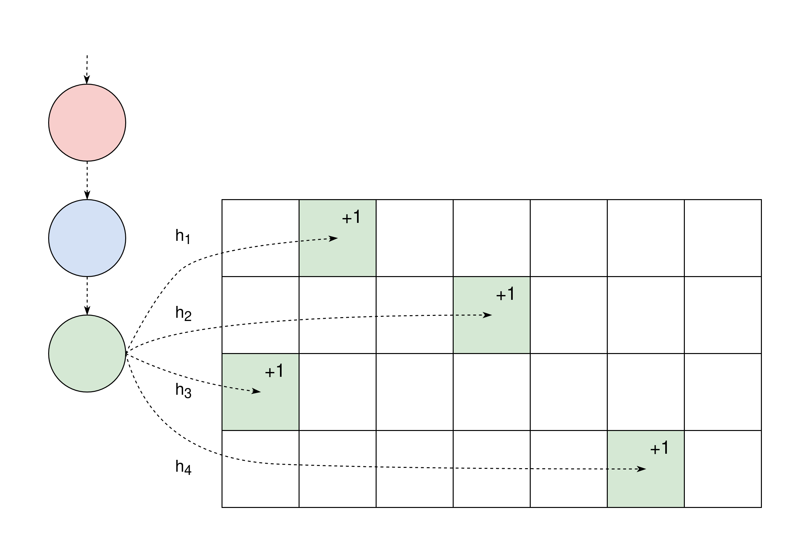
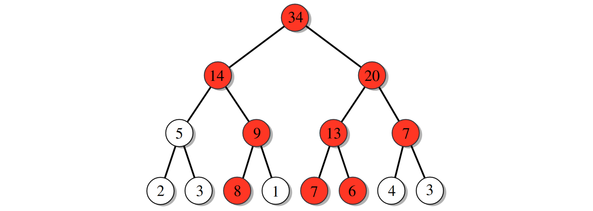

+++
title="Frequent Items in Data Streams"
description="An introduction to stream processing and the frequent item problem. We look at three algorithm types, but mainly on the nice idea of sketches."
date=2022-02-17

[taxonomies]
categories = ["Research summary"]
tags = ["research", "stream data"]

[extra]
toc = true
+++

Big data streams are everywhere today as we get increasingly digital, as well as taking more and more automated measurements. An example could be search queries with an internet search engine, where the provider would want to analyze search patterns, such as common searches. It is often preferable to process these streams online, meaning we don't store the data and only make one pass over it. Some metrics such as variance are possible to compute like this, but for many others you have to give up some required information, making the results only approximately true (do you remember your epsilon delta proofs?). 

This post gives an introduction to the topic of finding frequent items in data streams using these online algorithms. It is mainly based on the papers [_Methods for Finding Frequent Items in Data Streams_](http://dimacs.rutgers.edu/~graham/pubs/papers/freqvldbj.pdf) as well as [_What’s New: Finding Significant Differences in Network Data Streams_](https://ieeexplore.ieee.org/stamp/stamp.jsp?tp=&arnumber=1561219) with _Graham Cormode_ being first author for both. The first gives an overview of all methods, while the second is needed to fully understand the last one. The sections about specific algorithms have links to the originating paper as well.

## Problem description

Apart from having to do only one pass over the input, we are also required to use memory strictly sublinear to the input size. Otherwise all the information in the stream could just be saved and the exact result always found... 

The streaming problem studied here is the frequent item problem which the first paper describe like this.
>  Informally, given a sequence of items, the problem is simply to find those items which occur most frequently. Typically, this is formalized as finding all items whose frequency exceeds a specified fraction [(φ)] of the total number of items. Variations arise when the items are given weights, and further when these weights can also be negative.

To solve this problem in a generic way you need to use memory linear to the input size, but since we don't want that they formulate the ε-approximate frequent item problem as finding a set of items all having frequency larger than (φ − ε), and that all items with frequency larger than φ must be included in the set.

A related problem it that of frequency estimation and requires you to be able to estimate the frequency of any item, with an error of at most ε. In theory a solution to this problem also solves the ε-approximate frequent item problem, as you can iterate over all possible inputs (if it's a finite input space). But of course it would be a very slow solution, so the last part of the post presents some other ways to generalize between the problems.


## Counter based algorithms

The first paper presents three different groups of algorithms for the problem, and the counter based ones are the simplest, keeping a fixed set of counters in some way associated with items in the stream. When a new item is read the algorithm decides if it should be kept, and what counts it is associated with.

### [The Frequent Algorithm](https://dl.acm.org/doi/10.1145/762471.762473)

This is the most basic counter algorithm but displays the base idea brilliantly. It has a set of **k - 1** counters associated with one item each, and the idea is that if an item has a frequency of higher than **|items|/k** it will be associated with one of the counters. For every new item it increments its counter if it has one, or else assigns it an unused counter, or otherwise decrements all other counters. If a counter is 0 it is considered to be unused.

``` rust
for i in items
    n += 1
    if i in T
        counters[i] += 1
    else if |T| < k - 1
        T.add(i)
        counters[i] = 1
    else
        for j in T
            counters[j] -= 1
            if counters[j] = 0
                T.remove(j)
```

The problem with this is that it will contain false positives. Since if there are not **k-1** elements with frequency larger than **|items|/k**, the counters will still have a large chance of being in use at the end. Since we are only allowed one pass over the data we can't verify which of the found items are actually common. But if there are sufficiently frequent items they will be found and the simplicity of the algorithm is impressive.

## Quantile algorithms

These algorithms are about finding the φ-quantiles, which can be seen as a slightly different problem to the frequent items one, but a bit more general. It is helpful to define the rank of an item as the sum of the frequencies of all less frequent items. The ε-approximate problem then allows **εn** uncertainty in ranks for the quantiles.

### [The GK Algorithm](https://dl.acm.org/doi/10.1145/376284.375670)

The base idea is similar to the one for counters, where it keeps counts for a subset of the items it determines important. But here it does not only need the frequent items, but items everywhere to cover quantiles. It it cool, but if it is too unintuitive I recommend just skipping to the cool sketch algorithm!

For each stored item **i** it implicitly keeps track of its maximum (r_max) and minimum (r_min) rank. These are encoded into two more convenient variables **Δ(i) = r_max(i) - r_min(i)** and **g[i] = r_min[i] - r_min[i-1]**, where the items are sorted based on frequency. Every item, whether stored or not, can then be given an estimate with these values.

Every new item is initialized with **g = 1** and **Δ = ⌊εn⌋** and then continually updated when new occurrences are found. Periodically it also compacts the set of tuples, removing ones where its neighbors are close enough to cover the required frequency range given by ε.

## Sketch algorithms

The idea of the sketches in the papers is to use several hash functions on each input and use them to index into a matrix of counts. Each row in the matrix (or sketch) has one hash function which uniformly distributes inputs over the columns. This process can also be seen as a linear projection of the implicit vector of item frequencies in the input stream, making for a nice mathematical expression, and is the more general definition of a sketch.



Sketch algorithms solve the frequency estimation problem and need some extra constructs to solve the frequent items one.

A nice thing with sketches is that they easily can be adopted to have general weights, even negative. This is not possible with the other methods. They are also often easy to merge, making parallelization possible which I enjoy.

### [The Count-Min Sketch](https://dl.acm.org/doi/10.1016/j.jalgor.2003.12.001)

This simle sketch keeps a matrix with one hash function per row as described above. Each arriving item in the stream is hashed by all hash functions, associating it with one column per row. Then all those associated counters are incremented by one, as shown in the image above.

To estimate the frequency of an item you then also use all hash functions but instead take the minimum of all the queried counters. This will always overestimate the count, but given an adequately sized matrix you can give a nice epsilon delta proof of the expected error.

### [The Count Sketch](https://dl.acm.org/doi/10.5555/646255.684566)

This is very similar to the CountMin sketch, but now each row has an extra hash function which hashes each function between -1 and 1. Instead of incrementing counters by 1 it now adds the extra hashed value.

To then query the sketch you for each row divide the associated counter with the extra hashed value. The median of all these values are then used as the expected count. This has the feature of not always overestimating the count, and can instead have errors on both sides.

### Efficient frequent items with Sketches

These sketches solves the problem of estimating the count of items, but not of finding the most frequent items in an efficient way. There are some different ways to do this, but mainly three that are suggested by the author.

#### [Heap testing](https://dl.acm.org/doi/10.5555/646255.684566)

This method is the simplest and keeps a heap of **k** items and their approximate counts beside the sketch. The heap is maintained so to contain the most frequent items by checking their approximate counts as they are incremented.

This idea is used in other frameworks as well, but the big problem is that it cannot really handle when streams removes items (negative weights). But otherwise it is simple and nice.

#### [Hierarchy testing](https://dl.acm.org/doi/10.1016/j.jalgor.2003.12.001)

If the input domain is finite and can be enumerated efficiently we can use an approximation of the idea shown in the figure below. Each item in the input domain is represented by a leaf containing the count of the value in the stream. Each node contains the count of all leafs below. It then becomes quite simple to do a divide and conquer search to find all items/leafs more frequent than a certain threshold.



Although nice, it becomes very unwieldy to have that many nodes. An approximate version replaces each layer in the tree by a sketch encoding the same information. The bottommost layer is the normal sketch of approximate item counts. The middle layers don't encode node counts, but instead like the implicit nodes they contain the approximate counts of the ranges of items.


#### [Group testing](https://dl.acm.org/doi/10.1109/TNET.2005.860096)

This method is similar to the hierarchical testing above, but the hierarchy is achieved by increasing the dimension of the sketch to three. The depth in the new dimension is one plus the number of bits in the input domain. Then they also keep a normal 2D sketch as well, which is a little bit bigger than the 3D one in the first two dimensions. The explanations here are for CountMin sketches, but others can be used as well. (I wanted to add a figure here, but my app crashed and lost me 30 minutes of progress...)

For every item in the stream you count it in the 2D sketch as normal When incrementing a bucket (square in 2D sketch) in the 3D you first increment a "normal" counter for the bucket. Then you go into the new dimension and increment the counters where the items bit at the 3D index is 1. So for the item 11 you would increment counters at index 1, 2, 4 in the new dimension as 11 = 1 + 2 + 8.

Queries of the sketch is divided into two phases. In the first phase they find candidates for heavy items (using the 3D sketch), and in the second one they remove some false positives (using the 2D one).

Candidates are found by looking at all buckets in the 3D sketch with their normal count larger than the chosen frequency threshold. Then it searches all binary indices larger than the threshold to find the binary representation of the frequent item. One edge case here is that if one such binary count as well as its negation (the buckets normal count minus the binary count) are both larger than the threshold, then the bucket must contain two frequent items and the search is discarded (hopefully you will find both items in other buckets).

``` rust
candidates = {}
for row, col in 3D_rows, 3D_cols
    if 3D[row, col, 0] > THRESHOLD
        candidates.add_some(bit_search(3D[row, col, :]))

fn bit_search(bit_arr)
    // bit_arr[0] is the "normal"/total counter
    for bit_ind, bit_count in enumerate(bit_arr[1:])
        if bit_count > THRESHOLD && bit_arr[0] - bit_count > THRESHOLD
            // Two frequent numbers in the same bucket, abort
            return None
        else if bit_count > THRESHOLD
            binary += 1 << bit_ind
    return Some(binary)
```

The verification iterates over the set of candidates and queries their estimated count in the 2D sketch. If a count is not large enough it must be a false positive (at least for CountMin), so it can be discarded. The remaining items are returned as heavy hitters.

``` rust
frequent = {}
for candidate in candidates
    estimate = min(2D[row, row_hash(candidate)] for row in 2D_rows)
    if estimate > THRESHOLD
        frequent.add(candidate)
```

## Conclusion

I think the papers have some cool ideas. The counter methods are very simple and fast which is nice. But the simple idea behind the CountMin sketch is very pretty, even though a bit slower. In general the sketch methods catch my fancy every time.

However, even though the sketches are nice, the two last methods have a big overhead cost, and lack the simplicity of normal sketches. Furthermore, they really need their input to be in an enumerable, preferably dense, domain. This makes them a bit frustrating, but it is hard to change as the base sketches were designed for the frequency estimation problem.
